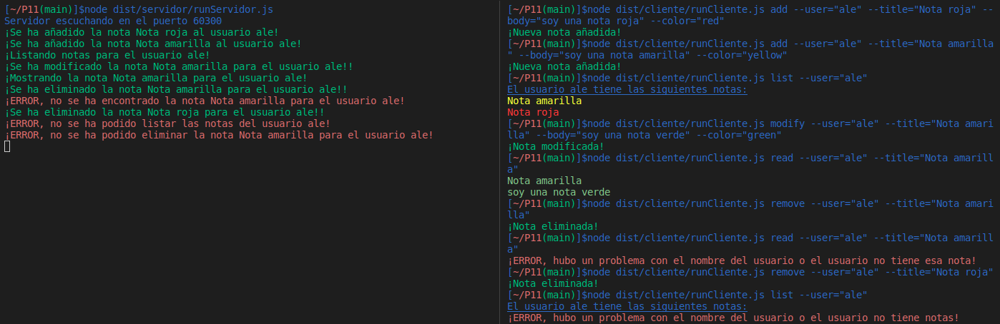

## Introducción
En esta práctica realizaremos 1 ejercicio en TypeScript utilizando node y algunas librerías, además intentaremos respetar los `principios SOLID`, crearemos el directorio adecuado para desarrollar proyectos en TS y utilizaremos herramientas como `EsLint` para el estilo del código según `Google` en nuestro caso, `TypeDoc` para la generación de la documentación del código de nuestro proyecto, `Mocha` y `Chai` para la creación de pruebas que nos permitiran llevar acabo el desarrollo `TDD` y multiples `github actions` como la de `Coveralls` y `Sonar`.

## Primeros pasos
Lo primero que tendremos que hacer es familiarizarnos con el [módulo `net` de Node.js](https://nodejs.org/dist/latest-v18.x/docs/api/net.html), con la clase [`EventEmitter` del módulo `Events` de Node.js](https://nodejs.org/dist/latest-v18.x/docs/api/events.html#events_class_eventemitter) y además tendremos que volver a utilizar los paquetes `yargs` y `chalk`.

## Ejercicio 1.

En este ejercicio tendremos que adaptar nuestro ejercicio Notas, realizado en la práctica 9, a un modelo servidor-cliente, para ello además de crear el código para el cliente y el servidor tendremos que modificar el código de la clase que se encarga de gestionar las notas, ya que en caso el método que lista las notas y que lee una nota no puede simplemente mostrar la información por pantalla y retornar verdadero en caso de éxito y falso en caso de fracaso, sino que en caso de éxito tiene que ser capaz de devolver la información para que esta pueda ser enviada al cliente. A su vez tendremos que modificar las `pruebas` de la clase Notas ya que el código va a ser modificado. El código de la clase GestionNota es el siguiente:
```typescript
import {Nota, colorType} from "./nota";
import {JSONNota} from "./jsonNota";
import * as fs from "fs";

const chalk = require("chalk");

/**
 * @class Gestion Nota
 */
export class GestionNota {
  /**
   * Método que crea una nota.
   * @param usuario nombre del usuario
   * @param titulo titulo de la nota
   * @param cuerpo cuerpo de la nota
   * @param color color de la nota
   * @returns true si se pudo añadir la nota, false si no.
   */
  añadirNota(usuario: string, titulo: string, cuerpo: string, color: colorType): boolean {
    if (!fs.existsSync(`database/${usuario}`)) {
      console.log(`Creando database para el usuario: ${usuario}`);
      
      fs.mkdirSync(`database/${usuario}`, {
        recursive: true,
      });
    }

    if (!fs.existsSync(`database/${usuario}/${titulo}.json`)) {
      const impNota = new JSONNota(new Nota(titulo, cuerpo, color));
      fs.writeFileSync(`database/${usuario}/${titulo}.json`, impNota.json());

      console.log(chalk.green(`¡Se ha añadido la nota ${titulo} al usuario ${usuario}!`));
      return true;
    } else {
      console.log(chalk.red(`¡ERROR, ya existe la nota ${titulo} para el usuario ${usuario}!`));
      return false;
    }
  }

  /**
   * Método que elimina la nota de un usuario.
   * @param usuario nombre del usuario
   * @param titulo titulo de la nota
   * @returns true si se eliminó la nota, false si no.
   */
  eliminarNota(usuario: string, titulo: string): boolean {
    if (fs.existsSync(`database/${usuario}/${titulo}.json`)) {
      fs.rmSync(`database/${usuario}/${titulo}.json`);
      console.log(chalk.green(`¡Se ha eliminado la nota ${titulo} para el usuario ${usuario}!!`));

      return true;
    } else {
      console.log(chalk.red(`¡ERROR, no se ha podido eliminar la nota ${titulo} para el usuario ${usuario}!`));

      return false;
    }
  }

  /**
   * Método que modifica una nota.
   * @param usuario nombre del usuario
   * @param titulo titulo de la nota
   * @param cuerpo cuerpo de la nota
   * @param color color de la nota
   * @returns true si la nota fue modificada, false si no.
   */
  modificarNota(usuario: string, titulo: string, cuerpo: string, color: colorType): boolean {
    if (fs.existsSync(`database/${usuario}/${titulo}.json`)) {
      const impNota = new JSONNota(new Nota(titulo, cuerpo, color));

      fs.writeFileSync(`database/${usuario}/${titulo}.json`, impNota.json());
      console.log(chalk.green(`¡Se ha modificado la nota ${titulo} para el usuario ${usuario}!!`));

      return true;
    } else {
      console.log(chalk.red(`¡ERROR, no se ha podido modificar la nota ${titulo} para el usuario ${usuario}!`));
      return false;
    }
  }

  /**
   * Méto que lista las notas de un usuario.
   * @param usuario nombre del usuario
   * @returns true si el usuario tiene alguna nota, false si no.
   */
  listarNotas(usuario: string) {
    if (fs.existsSync(`database/${usuario}`) && fs.readdirSync(`database/${usuario}`).length > 0 ) {
      const auxNotas: Nota[] = [];
      fs.readdirSync(`database/${usuario}`).forEach((notas) => {
        const informacionNota = fs.readFileSync(`database/${usuario}/${notas}`);
        const jsonNota = JSON.parse(informacionNota.toString());
        const nota = new Nota(jsonNota.titulo, jsonNota.cuerpo, jsonNota.color);

        auxNotas.push(nota);
      });

      console.log(chalk.green(`¡Listando notas para el usuario ${usuario}!`));
      return {exito: true, notas: auxNotas};
    } else {
      console.log(chalk.red(`¡ERROR, no se ha podido listar las notas del usuario ${usuario}!`));
      return {exito: false, notas: []};
    }
  }

  /**
   * Método que muestra la nota del usuario.
   * @param usuario nombre del usuario
   * @param titulo titulo de la nota
   * @returns true si se pudo encontrar la nota, false si no.
   */
  leerNota(usuario: string, titulo: string) {
    if (fs.existsSync(`database/${usuario}/${titulo}.json`)) {
      const informacionNota = fs.readFileSync(`database/${usuario}/${titulo}.json`);
      const jsonNota = JSON.parse(informacionNota.toString());
      const nota = new Nota(jsonNota.titulo, jsonNota.cuerpo, jsonNota.color);

      console.log(chalk.green(`¡Mostrando la nota ${titulo} para el usuario ${usuario}!`));
      return {exito: true, nota: [nota]};
    } else {
      console.log(chalk.red(`¡ERROR, no se ha encontrado la nota ${titulo} para el usuario ${usuario}!`));
      return {exito: false, nota: []};
    }
  }
}
```

Para todos los métodos hemos cambiado los mensajes que salen por pantalla para adaptarlos al mensaje que debería salir en el servidor. Para el método `leerNota` y `listarNota` retornaremos un tipo de dato que tiene un `boolean` exito, que indica si la ejecución del método fue correcta o incorrecta y un `array de Nota` llamado nota que contiene la información de las nota que el cliente ha solicitado en caso de éxito o un array vacío en caso de que el método no se haya podido ejecutar. Estas son las pruebas de la clase `GestionNota` que son las únicas que han recibido cambios respecto a las anteriores prácticas.
```typescript
import 'mocha';
import {expect} from "chai";
import {Nota} from '../../src/notas/nota';
import {GestionNota} from "../../src/notas/gestionNota";


const gestion = new GestionNota();

describe("Pruebas clase GestionNota", () => {
  it('Crear una instancia de la clase', () => {
    expect(gestion).instanceOf(GestionNota);
  });
  it('Añadir una nota', () => {
    expect(gestion.añadirNota("ale", "lista verde", "soy una lista verde", "green")).to.eql(true);
  });
  it('Añadir una nota', () => {
    expect(gestion.añadirNota("ale", "lista verde", "soy una lista verde", "green")).to.eql(false);
  });
  it('Modificar una nota', () => {
    expect(gestion.modificarNota("ale", "lista verde", "ahora soy una lista amarilla", "yellow")).to.eql(true);
  });
  it('Modificar una nota que no existe', () => {
    expect(gestion.modificarNota("pedro", "lista verde", "ahora soy una lista amarilla", "yellow")).to.eql(false);
  });
  it('Listar Notas', () => {
    expect(gestion.listarNotas("ale")).to.eql({exito: true, notas: [new Nota("lista verde", "ahora soy una lista amarilla", "yellow")]});
  });
  it('Listar Notas de un usuario que no existe', () => {
    expect(gestion.listarNotas("pedro")).to.eql({exito: false, notas: []});
  });
  it('Leer una Nota', () => {
    expect(gestion.leerNota("ale", "lista verde")).to.eql({exito: true, nota: [new Nota("lista verde", "ahora soy una lista amarilla", "yellow")]});
  });
  it('Leer una Nota no existente', () => {
    expect(gestion.leerNota("ale", "lista negra")).to.eql({exito: false, nota: []});
  });
  it('Eliminar una Nota', () => {
    expect(gestion.eliminarNota("ale", "lista verde")).to.eql(true);
  });
  it('Eliminar una Nota que no existe', () => {
    expect(gestion.eliminarNota("ale", "lista verde")).to.eql(false);
  });
});
```

Para desarrollar tanto el servidor como el cliente para cada uno haremos uso de una clase que se encargue de recibir la información por parte del socket y cuando haya recibido toda la información (encuentre un \n) se encargue de emitir un evento con la información en un formato JSON, para ello cada clase Emitter (EventEmitterCliente y EventEmitterServidor) haran uso de dos tipos de datos, `RequestType` para el servidor y `ResponseType` para el cliente. Gracias a esto tanto el servidor como el cliente solo tienen que poner el código dentro del evento que emite cada clase Emitter creada por nosotros y sacar la información del JSON. Los tipos de datos RequestType y ResponseType tienen la siguiente estructura:
```typescript
import {colorType} from "./notas/nota";
import {Nota} from "./notas/nota";

/**
 * @type RequestType
 */
export type RequestType = {
    type: 'add' | 'modify' | 'remove' | 'read' | 'list';
    user: string;
    title?: string;
    body?: string;
    color?: colorType;
  }

/**
 * @type ResponseType
 */
export type ResponseType = {
    type: 'add' | 'modify' | 'remove' | 'read' | 'list';
    success: boolean;
    notes?: Nota[];
  }

/**
 * @type ModificacionServidorType
 */
export type ModificacionServidorType = {
  comando: string;
  opciones: string[];
  ruta: string;
}

/**
 * @type ModificacionClienteType
 */
export type ModificacionClienteType = {
  resultado: string;
}

```

El código de las clases event emitter es el siguiente:
* EventEmitterCliente:

```typescript
import {EventEmitter} from "events";
import {ResponseType} from "../peticiones";

/**
 * @class EventEmitterCliente
 */
export class EventEmitterCliente extends EventEmitter {
  /**
   * Constructor
   * @param connection Objeto eventEmiter para poder actuar segun el evento recibido.
   */
  constructor(connection: EventEmitter) {
    super();

    let informacion = '';
    connection.on('data', (datos) => {
      informacion += datos;

      let limite: number = informacion.indexOf('\n');

      while (limite !== -1) {
        const respuesta: ResponseType = JSON.parse(informacion.substring(0, limite));
        informacion = informacion.substring(limite + 1);
        this.emit('respuesta', respuesta);
        limite = informacion.indexOf('\n');
      }
    });
  }
}
```

* EventEmitterServidor:

```typescript
import {EventEmitter} from "events";
import {RequestType} from "../peticiones";

/**
 * @class EventEmitterServidor
 */
export class EventEmitterServidor extends EventEmitter {
  /**
   * Constructor
   * @param connection Objeto eventEmiter para poder actuar segun el evento recibido.
   */
  constructor(connection: EventEmitter) {
    super();

    let informacion = '';
    connection.on('data', (datos) => {
      informacion += datos;

      let limite: number = informacion.indexOf('\n');

      while (limite !== -1) {
        const peticion: RequestType = JSON.parse(informacion.substring(0, limite));
        informacion = informacion.substring(limite + 1);
        this.emit('peticion', peticion);
        limite = informacion.indexOf('\n');
      }
    });
  }
}
```

Llegados a este punto solo nos quedaría hablar de la implementación de la clase cliente y servidor. Empecemos por la clase servidor, lo primero que hacemos es poner al servidor a escuchar en un puerto, gracias al uso de sockets y luego cuando si eventEmitter emita el evento `petición` querrá decir que el cliente a enviado la informacion. Procedemos a procesarla con un switch y luego le enviamos la respuesta al cliente. El cliente se conecta al puerto donde está escuchando el servidor que previamente tiene que estar abierto y envía la información al servidor que haya recibido por parámetros, cuando su eventEmitter emita el evento `respuesta` querrá decir que el servidor le ha respondido y precesará la respuesta. Cuando el servidor responde al cliente lo desconecta del puerto para de esta forma acabar la interacción. Ese es el código del servidor y del cliente:

* Servidor


```typescript
import * as net from "net";
import {ResponseType, RequestType} from "../peticiones";
import {EventEmitterServidor} from "./eventEmitterServidor";
import {GestionNota} from "../notas/gestionNota";
import {Nota} from "../notas/nota";

/**
 * @class Servidor
 */
export class Servidor {
  private manejador = new GestionNota();
  /**
   * Constructor
   * @param puerto puerto de escucha
   */
  constructor(private readonly puerto: number) {}

  /**
   * Método que pone al servidor a escuchar en un puerto y a recibir peticiones-
   */
  run() {
    net.createServer((connection) => {
      const emitter = new EventEmitterServidor(connection);
      emitter.on("peticion", (peticion: RequestType) => {
        const respuesta: ResponseType = {type: peticion.type, success: false};

        switch (peticion.type) {
          case "add":
            if (peticion.title && peticion.body && peticion.color) {
              if (this.manejador.añadirNota(peticion.user, peticion.title, peticion.body, peticion.color)) {
                respuesta.success = true;
              } 
            }
            break;
          case "remove":
            if (peticion.title) {
              if (this.manejador.eliminarNota(peticion.user, peticion.title)) {
                respuesta.success = true;
                respuesta.notes = [new Nota(peticion.title, "", "blue")];
              } 
            }
            break;
          case "modify":
            if (peticion.title && peticion.body && peticion.color) {
              if (this.manejador.modificarNota(peticion.user, peticion.title, peticion.body, peticion.color)) {
                respuesta.success = true;
                respuesta.notes = [new Nota(peticion.title, peticion.body, peticion.color)];
              } 
            }
            break;
          case "list":
            const aux = this.manejador.listarNotas(peticion.user);
            respuesta.success = aux.exito;
            respuesta.notes = aux.notas;
            break;
          case "read":
            if (peticion.title) {
              const aux = this.manejador.leerNota(peticion.user, peticion.title);
              respuesta.success = aux.exito;
              respuesta.notes = aux.nota;
            }
            break;
        }
        
        connection.write(JSON.stringify(respuesta) + "\n", (err) => {
          if (err) console.log("Hubo un problema al enviar la respuesta");
          connection.end();
        });
      });
    }).listen(this.puerto, () => {
      console.log(`Servidor escuchando en el puerto ${this.puerto}`);
    });
  }
}
```

* Cliente


```typescript
import * as net from "net";
import {Nota} from "../notas/nota";
import {ResponseType, RequestType} from "../peticiones";
import {EventEmitterCliente} from "./eventEmitterCliente";
const chalk = require("chalk");

/**
 * @class Cliente
 */
export class Cliente {
  /**
   * Constructor
   * @param puerto puerto por el cual comunicarse con el servidor.
   */
  constructor(private readonly puerto: number) {}

  /**
   * Metodo que ejecuta al cliente.
   * @param peticion Peticion a realizar al servidor
   */
  run(peticion: RequestType) {
    const cliente = net.connect({port: this.puerto});
    const emitter = new EventEmitterCliente(cliente);

    emitter.on("respuesta", (respuesta: ResponseType) => {
      switch (respuesta.type) {
        case "add":
          if (respuesta.success) {
            console.log(chalk.green("¡Nueva nota añadida!"));
          } else {
            console.log(chalk.red("¡ERROR, ya existe una nota con ese título!"));
          }
          break;
        case "remove":
          if (respuesta.success) {
            console.log(chalk.green("¡Nota eliminada!"));
          } else if (respuesta.notes) {
            const notaObjeto = new Nota(respuesta.notes[0].titulo, respuesta.notes[0].cuerpo, respuesta.notes[0].color);
            console.log(chalk.red(`¡ERROR, no se ha encontrado la nota ${notaObjeto.getTitulo()}!`));
          }
          break;
        case "modify":
          if (respuesta.success) {
            console.log(chalk.green("¡Nota modificada!"));
          } else if (respuesta.notes) {
            const notaObjeto = new Nota(respuesta.notes[0].titulo, respuesta.notes[0].cuerpo, respuesta.notes[0].color);
            console.log(chalk.red(`¡ERROR, no se ha encontrado la nota ${notaObjeto.getTitulo()}!`));
          }
          break;
        case "list":
          if (respuesta.notes && respuesta.notes.length !== 0) {
            respuesta.notes.forEach((nota) => {
              const notaObjeto = new Nota(nota.titulo, nota.cuerpo, nota.color);
              console.log(chalk.keyword(notaObjeto.getColor())(notaObjeto.getTitulo()));
            });
          } else {
            console.log(chalk.red("¡ERROR, hubo un problema con el nombre del usuario o el usuario no tiene notas!"));
          }
          break;
        case "read":
          if (respuesta.notes && respuesta.notes.length !== 0) {
            const notaObjeto = new Nota(respuesta.notes[0].titulo, respuesta.notes[0].cuerpo, respuesta.notes[0].color);
            console.log(chalk.keyword(notaObjeto.getColor())(notaObjeto.getTitulo()));
            console.log(chalk.keyword(notaObjeto.getColor())(notaObjeto.getCuerpo()));
          } else {
            console.log(chalk.red("¡ERROR, hubo un problema con el nombre del usuario o el usuario no tiene esa nota!"));
          }
          break;
      }
    });
    cliente.write(JSON.stringify(peticion) + "\n", (err) => {
      if (err) {
        console.log("Ha ocurrido un error con la petición!");
      }
    });
  }
}
```

Estas son las pruebas que he realizado, me he centrado en las clases EventEmitterCliente y EventEmitterServidor ya que al servidor y al cliente se nos dificulta esta tarea ta que tienen que conectarse a un puerto.

* EventEmitterServidor


```typescript
import 'mocha';
import {expect} from 'chai';
import {EventEmitter} from 'events';
import {EventEmitterServidor} from '../../src/servidor/eventEmitterServidor';

describe('EventEmitterServidor', () => {
    it('Debería emitir una peticion', (done) => {
      const socket = new EventEmitter();
      const auxEventEmitterServidor = new EventEmitterServidor(socket);

      auxEventEmitterServidor.on('peticion', (message) => {
        expect(message).to.be.eql({'type': 'add', 'user': 'ale', 'title': 'Nota roja'});
        done();
      });
  
      socket.emit('data', '{"type": "add", "user": ');
      socket.emit('data', '"ale", "title": "Nota roja"');
      socket.emit('data', '}\n');
    });
  });
```

* EventEmitterCliente


```typescript
import 'mocha';
import {expect} from 'chai';
import {EventEmitter} from 'events';
import {EventEmitterCliente} from '../../src/cliente/eventEmitterCliente';

describe('EventEmitterCliente', () => {
    it('Debería emitir una respuesta', (done) => {
      const socket = new EventEmitter();
      const auxEventEmitterCliente = new EventEmitterCliente(socket);

      auxEventEmitterCliente.on('respuesta', (message) => {
        expect(message).to.be.eql({'type': 'add', 'success': false});
        done();
      });
  
      socket.emit('data', '{"type": "add"');
      socket.emit('data', ', "success": false}');
      socket.emit('data', '\n');
    });
  });
```

En la imagen 1 se puede apreciar un ejemplo del funcionamiento de nuestro programa:


__Imagen 1__